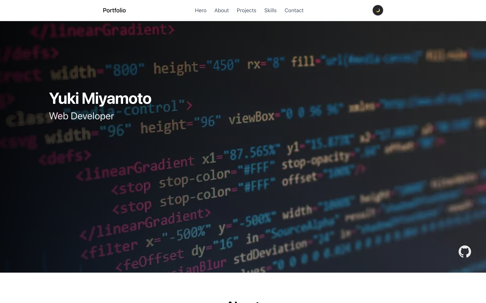

# Portfolio Website

[](https://nextjs.org/)
[](https://react.dev/)
[](https://www.typescriptlang.org/)
[](https://tailwindcss.com/)
[](https://vercel.com/)

## Live Demo

https://portfolio-flame-chi-96.vercel.app/

## Screenshot



## Overview

このサイトは **個人ポートフォリオサイト** です。

エンジニアとしての **スキル**、**制作物（プロジェクト）**、**プロフィール** を紹介し、採用担当者や他のエンジニアに自分を伝えるために制作しました。Next.js と TypeScript で構築し、モダンな UI とレスポンシブデザインを採用しています。

## Features

- **スムーズスクロールナビゲーション** — ナビゲーションリンクから各セクションへスムーズにスクロール
- **About セクションのタブ切り替えアニメーション** — プロフィール情報をタブで切り替え、Framer Motion によるアニメーション
- **プロジェクトカード表示** — 制作物をカード形式で一覧表示
- **Skills アイコン表示** — 技術スタックをアイコンで視覚的に表示
- **Skills 詳細表示機能（hover）** — スキルにホバーで詳細情報を表示
- **Contact フォーム** — EmailJS を用いたお問い合わせフォーム
- **ダークモード切り替え** — next-themes によるライト/ダークテーマの切り替え
- **レスポンシブデザイン** — スマートフォン・タブレット・PC に対応

## Tech Stack

| カテゴリ | 技術 |
|----------|------|
| **Frontend** | Next.js, React, TypeScript, HTML, CSS |
| **Styling** | Tailwind CSS, CSS |
| **Animation** | Framer Motion |
| **Icons** | React Icons, Devicon（SVG） |
| **Contact** | EmailJS |
| **Theme** | next-themes |
| **Deployment** | Vercel |

## Project Structure

```
src
├── app/
│   ├── layout.tsx      # ルートレイアウト
│   ├── page.tsx        # トップページ
│   └── globals.css     # グローバルスタイル
├── components/
│   ├── Navbar.tsx      # ナビゲーションバー
│   ├── Footer.tsx      # フッター
│   └── ProjectCard.tsx # プロジェクトカード
├── features/
│   ├── hero/           # ヒーローセクション
│   ├── about/          # About セクション
│   ├── skills/         # Skills セクション
│   ├── projects/       # プロジェクト一覧
│   └── contact/        # お問い合わせフォーム
└── lib/
    └── motion.ts       # Framer Motion 設定

public/
├── icons/              # 技術アイコン（Devicon 等）
└── img/                # 画像アセット
```

## Setup

### 1. リポジトリをクローン

```bash
git clone https://github.com/your-username/portfolio.git
cd portfolio
```

### 2. 依存関係のインストール

```bash
npm install
```

### 3. 開発サーバーの起動

```bash
npm run dev
```

ブラウザで [http://localhost:3000](http://localhost:3000) を開いて確認できます。

### 環境変数（Contact フォーム利用時）

Contact フォームで EmailJS を使う場合は、`.env.local` に以下を設定してください。

```
NEXT_PUBLIC_EMAILJS_SERVICE_ID=your_service_id
NEXT_PUBLIC_EMAILJS_TEMPLATE_ID=your_template_id
NEXT_PUBLIC_EMAILJS_PUBLIC_KEY=your_public_key
```

## Deployment

このサイトは **Vercel** にデプロイしています。

- リポジトリを Vercel に連携すると、プッシュのたびに自動でビルド・デプロイされます。
- 環境変数は Vercel のダッシュボードで設定してください。

## Future Improvements

- **Skills 詳細機能の強化** — スキルごとの説明や習熟度の可視化
- **Contact フォームの改善** — バリデーション強化、送信完了フィードバックの改善
- **UI/UX 改善** — アクセシビリティ対応、読み込み状態の最適化
- **新しいプロジェクトの追加** — 制作物の継続的な更新

## Author

**Yuki Miyamoto**

- GitHub: [https://github.com/TKtkGg](https://github.com/TKtkGg)
